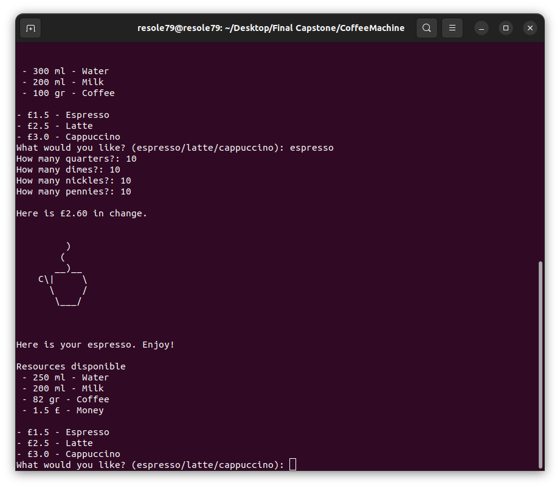
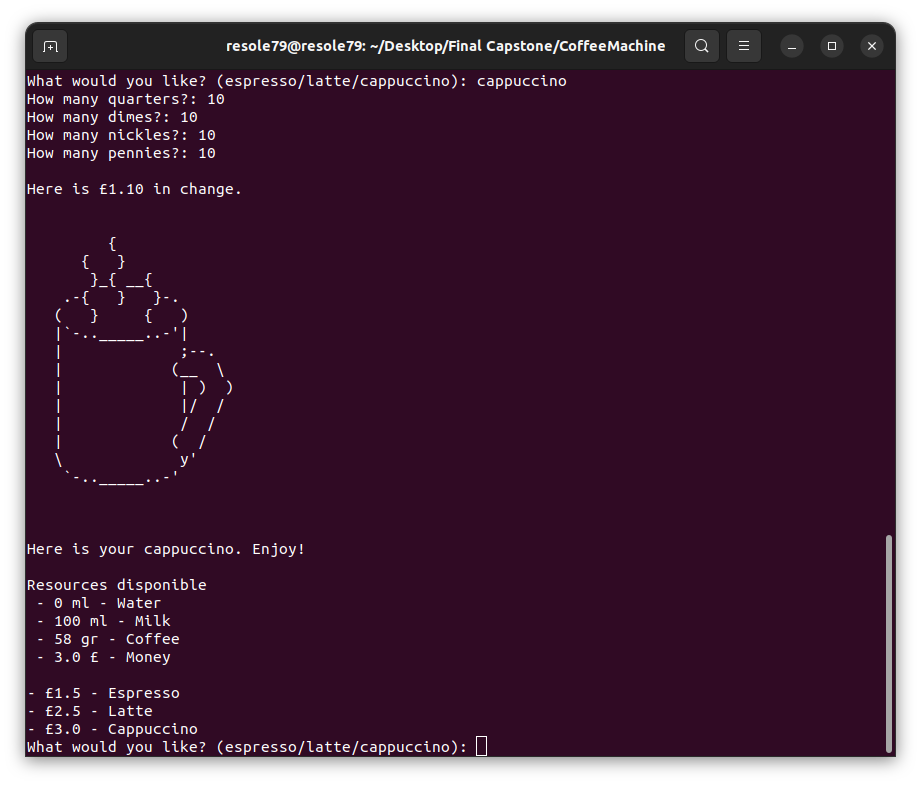

## Coffee Machine

Program to simulates a **Coffee Machine**  written in python.  

           
###### It's a part of the **#100DaysOfCode** challenge by Angela Yu. ######


#### Prerequisites
You will need the following software to run the Turtle function:
 - [Python 3](https://www.python.org/downloads/)
 

#### Installation
To get started with the "Coffee Machine", follow these steps:

1. **Clone** the repository:

```sh
git clone https://github.com/resole79/coffee_machine.git
```

2. **Run** the **coffee_machine.py** file:

```sh
python3 coffee_machine.py
```     

#### *File Structure*

 - **coffee_machine.py**: Main program.
 - **data.py** : File stores all the information
 - **art.py** : File contains the draws


#### **Usage**

```
    _______  _______  _______  _______  _______  _______       
   |       ||       ||       ||       ||       ||       |      
   |       ||   _   ||    ___||    ___||    ___||    ___|      
   |       ||  | |  ||   |___ |   |___ |   |___ |   |___       
   |      _||  |_|  ||    ___||    ___||    ___||    ___|      
   |     |_ |       ||   |    |   |    |   |___ |   |___       
   |_______||_______||___|    |___|    |_______||_______|      
 __   __  _______  _______  __   __  ___   __    _  _______ 
|  |_|  ||   _   ||       ||  | |  ||   | |  |  | ||       |
|       ||  |_|  ||       ||  |_|  ||   | |   |_| ||    ___|
|       ||       ||       ||       ||   | |       ||   |___ 
|       ||       ||      _||       ||   | |  _    ||    ___|
| ||_|| ||   _   ||     |_ |   _   ||   | | | |   ||   |___ 
|_|   |_||__| |__||_______||__| |__||___| |_|  |__||_______|
                              )              
                             (                 
                            __)__              
                         C\|     \   
                           \     /  
                            \___/                                                                
          +--------------------------------------+
          | OFF |_|             Insert Coin |_|  |
          |                                      |
          |               RESOURCES              |
          |               Water |_|              |
          |               Milk  |_|              |
          |             Coffee  |_|              |
          |                                      |
          |                                      |
          |           Espresso  £ ---       |_|  |
          |                                      |
          |              Latte  £ ---       |_|  |
          |                                      |
          |         Cappuccino  £ ---       |_|  |
          |                                      |
          |                                      |
          |           |________________|         |
          +--------------------------------------+
   
```

**How program present**




## **Credit**

Author : Emilio Reforgiato (resole79)

##
<p align="right"><a href="https://www.linkedin.com/in/emilio-reforgiato/" target=”_blank” ></a></p>


